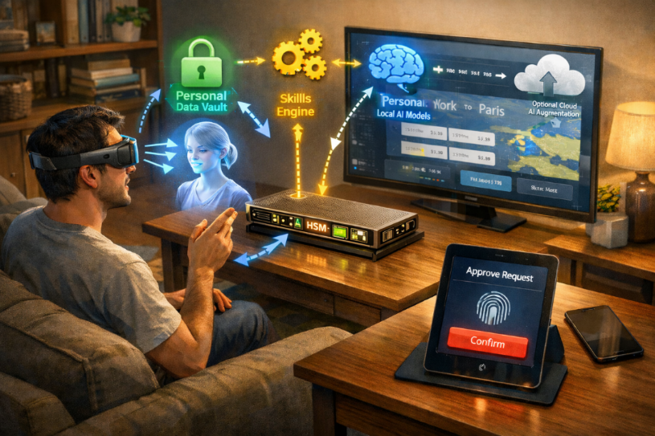

# Personalized AI

## Overview

**Personalized AI Buddy** is a local-first, privacy-preserving, skill-based AI system built around the individual. Unlike today's cloud-centric assistants, your AI Buddy treats personal data ownership, hardware-rooted trust, and user-taught skills as core architectural primitives.

> Intelligence should live where your life lives.

---

## Core Idea

Your Personalized AI Buddy runs primarily on your own devices, learns your habits and skills over time, keeps your data private by default, and acts on your behalf only with explicit approval.

It's not a chatbot. It's not a cloud API.  
It's an **operating environment for personal intelligence**.

---

## What Makes This Different

| Today's AI (Copilot, Gemini) | Personalized AI |
|-----------------------------|-----------------|
| Cloud-first | Local-first |
| Account-based memory | Hardware-bound memory |
| Prompt-driven | Skill-driven |
| Vendor-controlled | User-owned |
| Implicit trust | Cryptographic trust |

---

## Design Principles

1. **Local-first by default** — Personal data and memory stay local
2. **Privacy as architecture** — Not a feature, but a system property
3. **Skills over prompts** — Executable, testable intelligence
4. **Hardware-rooted trust** — Identity and encryption anchored in secure hardware
5. **Human-in-the-loop control** — Privileged actions always require approval
6. **Composable evolution** — From personal skills to physical robots

---

## Key Components

### Personal AI Node
Your local compute device with GPU, secure storage, and HSM for trust.

### Two-Tier Data Storage
Hardened Vault (HSM-protected) for credentials and sensitive data; Encrypted Storage for documents, preferences, and personal information.

### Skills System
Learned, executable capabilities that evolve with you over time.

### Model Context Protocol (MCP)
Standard interface connecting skills to apps, devices, and systems.

### Optional Cloud Augmentation
Heavy compute tasks use cloud AI—but stateless, memory-free, and under your control.

---

## Evolution Path

### Phase 1 (2026): Personal AI Node
Usable personalized AI for daily life, with local models and skill authoring.

### Phase 2 (2027): Skills Ecosystem
Developer SDKs, intelligent MCPs, and early robotics integration.

### Phase 3 (2028-2029): Enterprise Ready
Security, compliance, and enterprise deployment patterns.

### Phase 4 (2030): Platform Maturity
Mainstream adoption, standardized platforms, and scaled robotics.

---

## Target Users

- **Privacy-conscious individuals** seeking true data ownership
- **Developers** wanting to extend AI capabilities safely
- **Enterprises** needing compliant, trusted AI assistants
- **Researchers** exploring next-gen AI architectures
- **Robotics enthusiasts** building physical-world automation

---

## Documentation Structure

- **[01_Executive_Summary_Vision.md](01_Executive_Summary_Vision.md)** — Vision, manifesto, and why this matters
- **[02_System_Architecture.md](02_System_Architecture.md)** — Technical architecture and trust model
- **[03_Skills_Platform.md](03_Skills_Platform.md)** — Skills system, MCP, and developer platform
- **[04_Roadmap_Evolution.md](04_Roadmap_Evolution.md)** — Timeline and path to robotics
- **[05_Market_Comparison.md](05_Market_Comparison.md)** — How this differs from cloud AI
- **[06_Use_Cases.md](06_Use_Cases.md)** — Real-world applications and examples

---

## Getting Started

1. Read the [Executive Summary & Vision](01_Executive_Summary_Vision.md) to understand the why
2. Review the [System Architecture](02_System_Architecture.md) to see how it works
3. Explore the [Skills & Platform](03_Skills_Platform.md) to understand capabilities
4. Check the [Roadmap](04_Roadmap_Evolution.md) for timeline and evolution

---

## Current Status

This project focuses on **conceptual architecture and system design**.
---

## License

TBD (conceptual documentation only)

---

## Contact

For questions, feedback, or collaboration: [Contact information to be added]
